## Contents
{:.no_toc}
*  
{: toc}


```python
import numpy as np
import pandas as pd
import matplotlib
import matplotlib.pyplot as plt
from sklearn.linear_model import LogisticRegressionCV
import sklearn.metrics as metrics
from sklearn.preprocessing import PolynomialFeatures
from sklearn.discriminant_analysis import LinearDiscriminantAnalysis
from sklearn.discriminant_analysis import QuadraticDiscriminantAnalysis
from sklearn.neighbors import KNeighborsClassifier
from sklearn.tree import DecisionTreeClassifier
from sklearn.model_selection import cross_val_score
from sklearn.model_selection import KFold
from sklearn.model_selection import GridSearchCV
from sklearn import tree
from sklearn.metrics import confusion_matrix
from sklearn.metrics import roc_curve, auc, roc_auc_score
import json
from sklearn.tree import export_graphviz
from IPython.display import Image
from IPython.display import display
from IPython.display import display, Math, Latex
%matplotlib inline

import warnings
warnings.filterwarnings('ignore')

pd.set_option('display.width', 450)
pd.set_option('display.max_columns', 100)
pd.set_option('display.notebook_repr_html', True)
import seaborn.apionly as sns
sns.set_style("whitegrid")

c0=sns.color_palette()[0]
c1=sns.color_palette()[1]
c2=sns.color_palette()[2]
```


<font color='green'>

### As we have large amounf data so we are loading data line by line in dataframe business_df, review_df, user_df


```python
import json

def readjson(filepath):
    data = []
    i=0
    with open(filepath,encoding="utf8") as f:
            for line in f:
                 if i<100000:
                    data.append(json.loads(line))
                    #print(i)
                    i +=1
    return pd.DataFrame(data)

business_df = readjson('./dataset/business.json')
review_df = readjson('./dataset/review.json')
user_df = readjson('./dataset/user.json')
```


<font color='green'>
### Getting reaturants out of business dataframe based on Food category


```python
business_df['categories'] = business_df['categories'].astype(str)
restaurant_df = business_df[business_df['categories'].str.contains('Food')==True]

complete_df = restaurant_df.merge(review_df,on='business_id').merge(user_df,on='user_id')

```


```python
complete_df.head(2)
```


<div>
<style>
    .dataframe thead tr:only-child th {
        text-align: right;
    }
    
    .dataframe thead th {
        text-align: left;
    }
    
    .dataframe tbody tr th {
        vertical-align: top;
    }
</style>
<table border="1" class="dataframe">
  <thead>
    <tr style="text-align: right;">
      <th></th>
      <th>address</th>
      <th>attributes</th>
      <th>business_id</th>
      <th>categories</th>
      <th>city</th>
      <th>hours</th>
      <th>is_open</th>
      <th>latitude</th>
      <th>longitude</th>
      <th>name_x</th>
      <th>neighborhood</th>
      <th>postal_code</th>
      <th>review_count_x</th>
      <th>stars_x</th>
      <th>state</th>
      <th>cool_x</th>
      <th>date</th>
      <th>funny_x</th>
      <th>review_id</th>
      <th>stars_y</th>
      <th>text</th>
      <th>useful_x</th>
      <th>user_id</th>
      <th>average_stars</th>
      <th>compliment_cool</th>
      <th>compliment_cute</th>
      <th>compliment_funny</th>
      <th>compliment_hot</th>
      <th>compliment_list</th>
      <th>compliment_more</th>
      <th>compliment_note</th>
      <th>compliment_photos</th>
      <th>compliment_plain</th>
      <th>compliment_profile</th>
      <th>compliment_writer</th>
      <th>cool_y</th>
      <th>elite</th>
      <th>fans</th>
      <th>friends</th>
      <th>funny_y</th>
      <th>name_y</th>
      <th>review_count_y</th>
      <th>useful_y</th>
      <th>yelping_since</th>
    </tr>
  </thead>
  <tbody>
    <tr>
      <th>0</th>
      <td>1203 E Charleston Blvd, Ste 140</td>
      <td>{'RestaurantsTableService': True, 'GoodForMeal...</td>
      <td>YTqtM2WFhcMZGeAGA08Cfg</td>
      <td>['Seafood', 'Restaurants', 'Specialty Food', '...</td>
      <td>Las Vegas</td>
      <td>{'Monday': '10:30-21:00', 'Tuesday': '10:30-21...</td>
      <td>1</td>
      <td>36.159363</td>
      <td>-115.135949</td>
      <td>Mariscos Playa Escondida</td>
      <td>Downtown</td>
      <td>89104</td>
      <td>330</td>
      <td>4.5</td>
      <td>NV</td>
      <td>0</td>
      <td>2016-09-16</td>
      <td>1</td>
      <td>ZH8g_PoY0Tr3YdQ-RGySrA</td>
      <td>5</td>
      <td>Great place. There was a man here who was very...</td>
      <td>1</td>
      <td>EDe16577dBImA1ypOzPlKg</td>
      <td>5.00</td>
      <td>0</td>
      <td>0</td>
      <td>0</td>
      <td>0</td>
      <td>0</td>
      <td>0</td>
      <td>0</td>
      <td>0</td>
      <td>0</td>
      <td>0</td>
      <td>0</td>
      <td>0</td>
      <td>[]</td>
      <td>0</td>
      <td>[]</td>
      <td>0</td>
      <td>Jessica</td>
      <td>1</td>
      <td>0</td>
      <td>2014-07-26</td>
    </tr>
    <tr>
      <th>1</th>
      <td>1203 E Charleston Blvd, Ste 140</td>
      <td>{'RestaurantsTableService': True, 'GoodForMeal...</td>
      <td>YTqtM2WFhcMZGeAGA08Cfg</td>
      <td>['Seafood', 'Restaurants', 'Specialty Food', '...</td>
      <td>Las Vegas</td>
      <td>{'Monday': '10:30-21:00', 'Tuesday': '10:30-21...</td>
      <td>1</td>
      <td>36.159363</td>
      <td>-115.135949</td>
      <td>Mariscos Playa Escondida</td>
      <td>Downtown</td>
      <td>89104</td>
      <td>330</td>
      <td>4.5</td>
      <td>NV</td>
      <td>1</td>
      <td>2014-11-13</td>
      <td>1</td>
      <td>6r2uAJE1dqUq1IHn_3R3qA</td>
      <td>4</td>
      <td>HOT HOT HOT! Real Mexican Food\n\nNO fake wate...</td>
      <td>2</td>
      <td>twx2ZgFUbat87vGQ_tFbPA</td>
      <td>3.55</td>
      <td>0</td>
      <td>0</td>
      <td>0</td>
      <td>2</td>
      <td>0</td>
      <td>1</td>
      <td>3</td>
      <td>0</td>
      <td>5</td>
      <td>0</td>
      <td>0</td>
      <td>11</td>
      <td>[]</td>
      <td>3</td>
      <td>[eFObFWgDiQJwUiy9WlhOfg, W4KL3Q_AVGfRrWcwR60gK...</td>
      <td>29</td>
      <td>Edwin</td>
      <td>94</td>
      <td>317</td>
      <td>2010-12-30</td>
    </tr>
  </tbody>
</table>
</div>


```python
restaurant_df.describe()
```


<div>
<style>
    .dataframe thead tr:only-child th {
        text-align: right;
    }
    
    .dataframe thead th {
        text-align: left;
    }
    
    .dataframe tbody tr th {
        vertical-align: top;
    }
</style>
<table border="1" class="dataframe">
  <thead>
    <tr style="text-align: right;">
      <th></th>
      <th>is_open</th>
      <th>latitude</th>
      <th>longitude</th>
      <th>review_count</th>
      <th>stars</th>
    </tr>
  </thead>
  <tbody>
    <tr>
      <th>count</th>
      <td>18503.00000</td>
      <td>18503.000000</td>
      <td>18503.000000</td>
      <td>18503.000000</td>
      <td>18503.000000</td>
    </tr>
    <tr>
      <th>mean</th>
      <td>0.83073</td>
      <td>39.702568</td>
      <td>-87.807760</td>
      <td>34.804464</td>
      <td>3.546857</td>
    </tr>
    <tr>
      <th>std</th>
      <td>0.37500</td>
      <td>5.747548</td>
      <td>27.691971</td>
      <td>82.946472</td>
      <td>0.889710</td>
    </tr>
    <tr>
      <th>min</th>
      <td>0.00000</td>
      <td>-34.520401</td>
      <td>-119.551325</td>
      <td>3.000000</td>
      <td>1.000000</td>
    </tr>
    <tr>
      <th>25%</th>
      <td>1.00000</td>
      <td>35.135615</td>
      <td>-112.013439</td>
      <td>5.000000</td>
      <td>3.000000</td>
    </tr>
    <tr>
      <th>50%</th>
      <td>1.00000</td>
      <td>40.440368</td>
      <td>-81.357777</td>
      <td>11.000000</td>
      <td>3.500000</td>
    </tr>
    <tr>
      <th>75%</th>
      <td>1.00000</td>
      <td>43.665419</td>
      <td>-79.414244</td>
      <td>31.000000</td>
      <td>4.000000</td>
    </tr>
    <tr>
      <th>max</th>
      <td>1.00000</td>
      <td>59.438181</td>
      <td>11.769500</td>
      <td>3439.000000</td>
      <td>5.000000</td>
    </tr>
  </tbody>
</table>
</div>


```python
user_df.describe()
```


<div>
<style>
    .dataframe thead tr:only-child th {
        text-align: right;
    }
    
    .dataframe thead th {
        text-align: left;
    }
    
    .dataframe tbody tr th {
        vertical-align: top;
    }
</style>
<table border="1" class="dataframe">
  <thead>
    <tr style="text-align: right;">
      <th></th>
      <th>average_stars</th>
      <th>compliment_cool</th>
      <th>compliment_cute</th>
      <th>compliment_funny</th>
      <th>compliment_hot</th>
      <th>compliment_list</th>
      <th>compliment_more</th>
      <th>compliment_note</th>
      <th>compliment_photos</th>
      <th>compliment_plain</th>
      <th>compliment_profile</th>
      <th>compliment_writer</th>
      <th>cool</th>
      <th>fans</th>
      <th>funny</th>
      <th>review_count</th>
      <th>useful</th>
    </tr>
  </thead>
  <tbody>
    <tr>
      <th>count</th>
      <td>100000.000000</td>
      <td>100000.000000</td>
      <td>100000.000000</td>
      <td>100000.000000</td>
      <td>100000.000000</td>
      <td>100000.000000</td>
      <td>100000.000000</td>
      <td>100000.000000</td>
      <td>100000.000000</td>
      <td>100000.000000</td>
      <td>100000.000000</td>
      <td>100000.000000</td>
      <td>100000.000000</td>
      <td>100000.000000</td>
      <td>100000.000000</td>
      <td>100000.000000</td>
      <td>100000.000000</td>
    </tr>
    <tr>
      <th>mean</th>
      <td>3.729684</td>
      <td>16.342210</td>
      <td>0.950070</td>
      <td>16.342210</td>
      <td>12.015470</td>
      <td>0.416970</td>
      <td>1.465460</td>
      <td>6.980040</td>
      <td>5.491070</td>
      <td>15.870480</td>
      <td>1.046280</td>
      <td>6.151540</td>
      <td>91.215580</td>
      <td>5.103230</td>
      <td>64.731610</td>
      <td>66.524450</td>
      <td>120.838970</td>
    </tr>
    <tr>
      <th>std</th>
      <td>0.835715</td>
      <td>197.424646</td>
      <td>16.639768</td>
      <td>197.424646</td>
      <td>175.458886</td>
      <td>7.165452</td>
      <td>15.762362</td>
      <td>70.410324</td>
      <td>153.225409</td>
      <td>194.113025</td>
      <td>19.474635</td>
      <td>73.883346</td>
      <td>1509.129416</td>
      <td>29.803631</td>
      <td>1049.502721</td>
      <td>178.975429</td>
      <td>1610.123217</td>
    </tr>
    <tr>
      <th>min</th>
      <td>1.000000</td>
      <td>0.000000</td>
      <td>0.000000</td>
      <td>0.000000</td>
      <td>0.000000</td>
      <td>0.000000</td>
      <td>0.000000</td>
      <td>0.000000</td>
      <td>0.000000</td>
      <td>0.000000</td>
      <td>0.000000</td>
      <td>0.000000</td>
      <td>0.000000</td>
      <td>0.000000</td>
      <td>0.000000</td>
      <td>0.000000</td>
      <td>0.000000</td>
    </tr>
    <tr>
      <th>25%</th>
      <td>3.350000</td>
      <td>0.000000</td>
      <td>0.000000</td>
      <td>0.000000</td>
      <td>0.000000</td>
      <td>0.000000</td>
      <td>0.000000</td>
      <td>0.000000</td>
      <td>0.000000</td>
      <td>0.000000</td>
      <td>0.000000</td>
      <td>0.000000</td>
      <td>0.000000</td>
      <td>0.000000</td>
      <td>0.000000</td>
      <td>5.000000</td>
      <td>0.000000</td>
    </tr>
    <tr>
      <th>50%</th>
      <td>3.810000</td>
      <td>0.000000</td>
      <td>0.000000</td>
      <td>0.000000</td>
      <td>0.000000</td>
      <td>0.000000</td>
      <td>0.000000</td>
      <td>0.000000</td>
      <td>0.000000</td>
      <td>0.000000</td>
      <td>0.000000</td>
      <td>0.000000</td>
      <td>0.000000</td>
      <td>0.000000</td>
      <td>0.000000</td>
      <td>16.000000</td>
      <td>2.000000</td>
    </tr>
    <tr>
      <th>75%</th>
      <td>4.240000</td>
      <td>1.000000</td>
      <td>0.000000</td>
      <td>1.000000</td>
      <td>0.000000</td>
      <td>0.000000</td>
      <td>0.000000</td>
      <td>1.000000</td>
      <td>0.000000</td>
      <td>1.000000</td>
      <td>0.000000</td>
      <td>1.000000</td>
      <td>2.000000</td>
      <td>2.000000</td>
      <td>3.000000</td>
      <td>50.000000</td>
      <td>13.000000</td>
    </tr>
    <tr>
      <th>max</th>
      <td>5.000000</td>
      <td>16710.000000</td>
      <td>2146.000000</td>
      <td>16710.000000</td>
      <td>19988.000000</td>
      <td>1265.000000</td>
      <td>1576.000000</td>
      <td>6340.000000</td>
      <td>33297.000000</td>
      <td>13075.000000</td>
      <td>2232.000000</td>
      <td>7117.000000</td>
      <td>175230.000000</td>
      <td>1837.000000</td>
      <td>103514.000000</td>
      <td>11065.000000</td>
      <td>187179.000000</td>
    </tr>
  </tbody>
</table>
</div>


```python
review_df.describe()
```


<div>
<style>
    .dataframe thead tr:only-child th {
        text-align: right;
    }
    
    .dataframe thead th {
        text-align: left;
    }
    
    .dataframe tbody tr th {
        vertical-align: top;
    }
</style>
<table border="1" class="dataframe">
  <thead>
    <tr style="text-align: right;">
      <th></th>
      <th>cool</th>
      <th>funny</th>
      <th>stars</th>
      <th>useful</th>
    </tr>
  </thead>
  <tbody>
    <tr>
      <th>count</th>
      <td>100000.000000</td>
      <td>100000.000000</td>
      <td>100000.000000</td>
      <td>100000.00000</td>
    </tr>
    <tr>
      <th>mean</th>
      <td>0.532470</td>
      <td>0.411740</td>
      <td>3.730530</td>
      <td>1.01213</td>
    </tr>
    <tr>
      <th>std</th>
      <td>1.992121</td>
      <td>1.655608</td>
      <td>1.418456</td>
      <td>2.46252</td>
    </tr>
    <tr>
      <th>min</th>
      <td>0.000000</td>
      <td>0.000000</td>
      <td>1.000000</td>
      <td>0.00000</td>
    </tr>
    <tr>
      <th>25%</th>
      <td>0.000000</td>
      <td>0.000000</td>
      <td>3.000000</td>
      <td>0.00000</td>
    </tr>
    <tr>
      <th>50%</th>
      <td>0.000000</td>
      <td>0.000000</td>
      <td>4.000000</td>
      <td>0.00000</td>
    </tr>
    <tr>
      <th>75%</th>
      <td>0.000000</td>
      <td>0.000000</td>
      <td>5.000000</td>
      <td>1.00000</td>
    </tr>
    <tr>
      <th>max</th>
      <td>104.000000</td>
      <td>114.000000</td>
      <td>5.000000</td>
      <td>113.00000</td>
    </tr>
  </tbody>
</table>
</div>


```python
review_df.head(2)
```


<div>
<style>
    .dataframe thead tr:only-child th {
        text-align: right;
    }
    
    .dataframe thead th {
        text-align: left;
    }
    
    .dataframe tbody tr th {
        vertical-align: top;
    }
</style>
<table border="1" class="dataframe">
  <thead>
    <tr style="text-align: right;">
      <th></th>
      <th>business_id</th>
      <th>cool</th>
      <th>date</th>
      <th>funny</th>
      <th>review_id</th>
      <th>stars</th>
      <th>text</th>
      <th>useful</th>
      <th>user_id</th>
    </tr>
  </thead>
  <tbody>
    <tr>
      <th>0</th>
      <td>uYHaNptLzDLoV_JZ_MuzUA</td>
      <td>0</td>
      <td>2016-07-12</td>
      <td>0</td>
      <td>VfBHSwC5Vz_pbFluy07i9Q</td>
      <td>5</td>
      <td>My girlfriend and I stayed here for 3 nights a...</td>
      <td>0</td>
      <td>cjpdDjZyprfyDG3RlkVG3w</td>
    </tr>
    <tr>
      <th>1</th>
      <td>uYHaNptLzDLoV_JZ_MuzUA</td>
      <td>0</td>
      <td>2016-10-02</td>
      <td>0</td>
      <td>3zRpneRKDsOPq92tq7ybAA</td>
      <td>3</td>
      <td>If you need an inexpensive place to stay for a...</td>
      <td>0</td>
      <td>bjTcT8Ty4cJZhEOEo01FGA</td>
    </tr>
  </tbody>
</table>
</div>


```python
user_df.head(2)
```


<div>
<style>
    .dataframe thead tr:only-child th {
        text-align: right;
    }
    
    .dataframe thead th {
        text-align: left;
    }
    
    .dataframe tbody tr th {
        vertical-align: top;
    }
</style>
<table border="1" class="dataframe">
  <thead>
    <tr style="text-align: right;">
      <th></th>
      <th>average_stars</th>
      <th>compliment_cool</th>
      <th>compliment_cute</th>
      <th>compliment_funny</th>
      <th>compliment_hot</th>
      <th>compliment_list</th>
      <th>compliment_more</th>
      <th>compliment_note</th>
      <th>compliment_photos</th>
      <th>compliment_plain</th>
      <th>compliment_profile</th>
      <th>compliment_writer</th>
      <th>cool</th>
      <th>elite</th>
      <th>fans</th>
      <th>friends</th>
      <th>funny</th>
      <th>name</th>
      <th>review_count</th>
      <th>useful</th>
      <th>user_id</th>
      <th>yelping_since</th>
    </tr>
  </thead>
  <tbody>
    <tr>
      <th>0</th>
      <td>3.80</td>
      <td>5174</td>
      <td>284</td>
      <td>5174</td>
      <td>5175</td>
      <td>78</td>
      <td>299</td>
      <td>1435</td>
      <td>7829</td>
      <td>7397</td>
      <td>569</td>
      <td>1834</td>
      <td>16856</td>
      <td>[2014, 2016, 2013, 2011, 2012, 2015, 2010, 2017]</td>
      <td>209</td>
      <td>[M19NwFwAXKRZzt8koF11hQ, QRcMZ8pJJBBZaKubHOoMD...</td>
      <td>16605</td>
      <td>Cin</td>
      <td>272</td>
      <td>17019</td>
      <td>lsSiIjAKVl-QRxKjRErBeg</td>
      <td>2010-07-13</td>
    </tr>
    <tr>
      <th>1</th>
      <td>3.94</td>
      <td>1556</td>
      <td>211</td>
      <td>1556</td>
      <td>1285</td>
      <td>101</td>
      <td>134</td>
      <td>1295</td>
      <td>162</td>
      <td>2134</td>
      <td>74</td>
      <td>402</td>
      <td>40110</td>
      <td>[2014, 2017, 2011, 2012, 2015, 2009, 2013, 200...</td>
      <td>835</td>
      <td>[eoSSJzdprj3jxXyi94vDXg, QF0urZa-0bxga17ZeY-9l...</td>
      <td>10882</td>
      <td>Andrea</td>
      <td>2559</td>
      <td>83681</td>
      <td>om5ZiponkpRqUNa3pVPiRg</td>
      <td>2006-01-18</td>
    </tr>
  </tbody>
</table>
</div>


<font color='green'>
### Performing Exploratory data analysis


```python
sns.pairplot(restaurant_df.iloc[0:10000,:]);
```


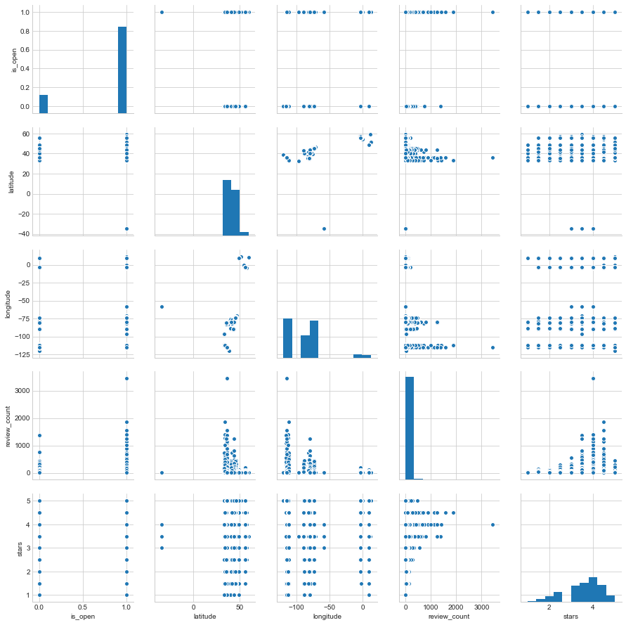


## Distribution count of Restaurant rating 
<font color='green'>
### We can see below more restaurants get 4 rating than other ratings


```python
fig, ax = plt.subplots(nrows=1, ncols=1, figsize=(15, 5))

sns.distplot(restaurant_df.stars,kde=False,color = 'g',ax =ax,bins=20);
ax.axvline(restaurant_df.stars.mean(), 0, 1, color='r', label='Mean')
ax.legend();
ax.set_ylabel('Count',size=20)
ax.set_xlabel('Stars',size=20)
ax.set_title('Distribution(count) of Restaurant rating',size=20);
```


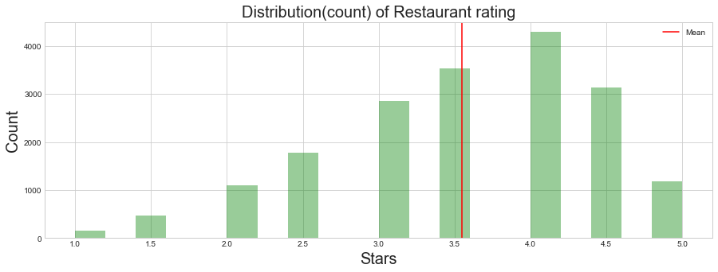


## Distribution count of Reviews rating for restaurants 
<font color='green'>
### We can see below more reviews have 5 rating than other ratings


```python
#review just for business which are restautrant
review_df_filter_df = review_df.merge(restaurant_df,how='inner',on='business_id')

fig, ax = plt.subplots(nrows=1, ncols=1, figsize=(15, 5))
sns.distplot(review_df_filter_df.stars_x,kde=False,color = 'g',ax =ax,bins=20);
ax.axvline(review_df_filter_df.stars_x.mean(), 0, 1, color='r', label='Mean')
ax.legend();
ax.set_ylabel('Count',size=20)
ax.set_xlabel('Stars',size=20)
ax.set_title('Distribution(count) of different Reviews rating',size=20)
```


    <matplotlib.text.Text at 0x117c2cc88>


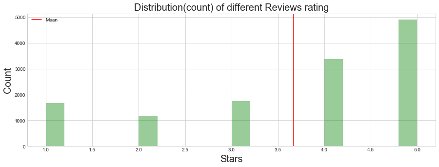


## Distribution count of user rating for restaurants 
<font color='green'>
### We can see below  users have around mean of 3.7  rating


```python
#user just for business which are restautrant
user_df_filter_df = complete_df.groupby(['user_id'],as_index=False).mean()

fig, ax = plt.subplots(nrows=1, ncols=1, figsize=(15, 5))
sns.distplot(user_df_filter_df.average_stars,kde=False,color = 'g',ax =ax,bins=20);
ax.axvline(user_df_filter_df.average_stars.mean(), 0, 1, color='r', label='Mean')
ax.legend();
ax.set_ylabel('Count',size=20)
ax.set_xlabel('Stars',size=20)
ax.set_title('Distribution(count) of User given rating',size=20)

#fig.tight_layout()
```


    <matplotlib.text.Text at 0x117a86128>


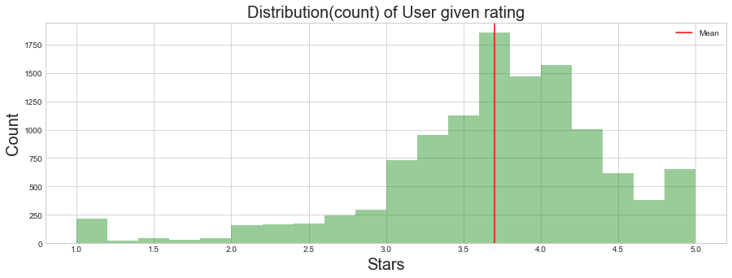


## Scatter plot various features 
<font color='green'>
### We can see that useful, funny and cool are correlated 


```python
sns.pairplot(review_df_filter_df.iloc[0:10000,:]);

```


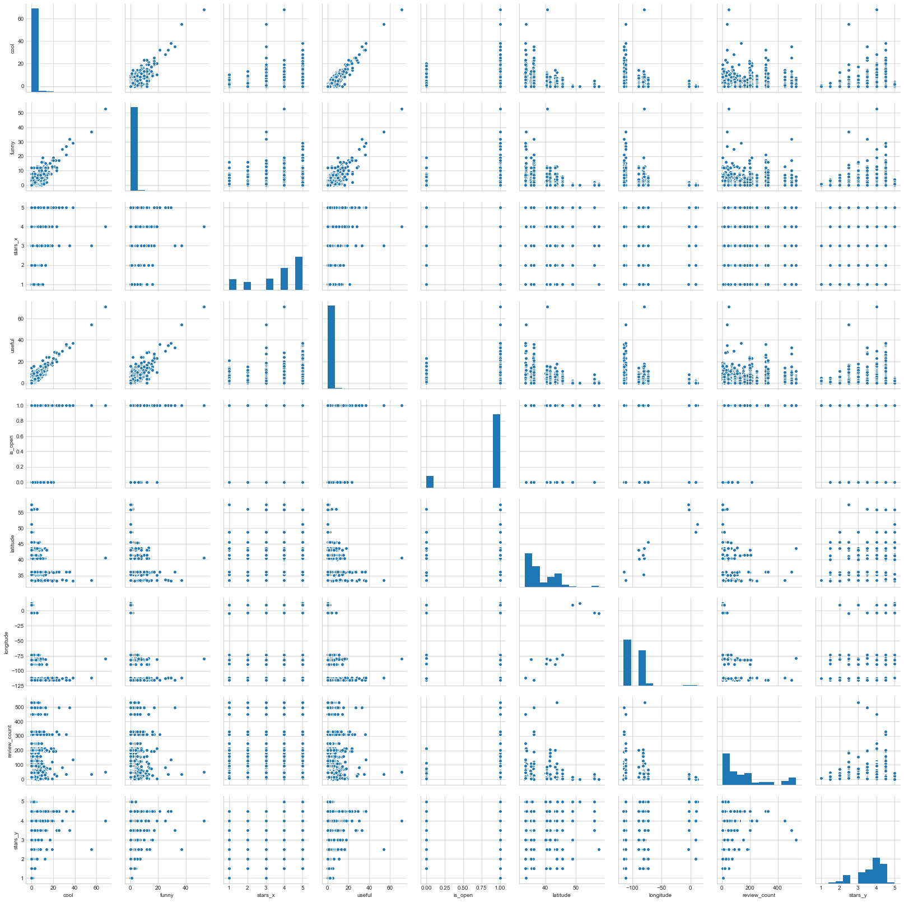


## Most Reviewed Restaurant
<font color='green'>
### Bouchon at the Venezia Tower is reviewed almost double as compared to others


```python
#get top 20 most reviewed restaurants
n_top =20
most_reviewed_restaurant = restaurant_df.nlargest(n_top, 'review_count')
fig, ax = plt.subplots()
ax = sns.barplot(y="name", x="review_count", data=most_reviewed_restaurant)
ax.set_xlabel('Review Count',size=20)
fig.set_size_inches(12, 8)
plt.title("Most Reviewed Restaurant",fontsize=24);
ax.grid(axis = 'x', color ='green', linestyle='-')
ax.tick_params(axis='both', which='both',length=0)
sns.despine(left=True, bottom=True)

```


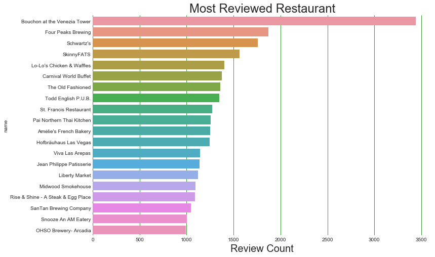


## Top 10 5 star rated Restaurant
<font color='green'>
### Poke Express is the top 5 star rated restaurant


```python
top_rated_restaurant = restaurant_df.sort_values(by=['stars','review_count'],
                                                 ascending=False)[['name','business_id','review_count','stars']]
#get top 10 5 star rated restaurant
n_top =10
top_rated_restaurant = top_rated_restaurant.nlargest(n_top, 'stars')
fig, ax = plt.subplots()
ax = sns.barplot(y="name", x="review_count", data=top_rated_restaurant)
ax.set_xlabel('Count',size=20)
fig.set_size_inches(12, 8)
plt.title("Top 10 5 star rated Restaurant",fontsize=24);
ax.grid(axis = 'x', color ='green', linestyle='-')
ax.tick_params(axis='both', which='both',length=0)
sns.despine(left=True, bottom=True)
```


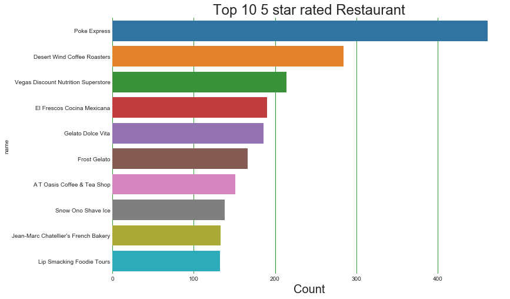


<font color='green'>
### Getting different food categories from the restaurant dataframe


```python
top_rated_restaurant = restaurant_df.sort_values(by=['stars','review_count'],
                                                 ascending=False)[['name','business_id','review_count','stars']]
#top_rated_restaurant
```


```python
def get_food_type_count(category):
    count = restaurant_df[restaurant_df['categories'].str.contains(category)==True]['business_id'].count()
    return count

```


```python
food_dict = {}
food_categories = ['American','Italian','Mexican','Chinese','Thai','Indian','Japan','French']
for food_category in food_categories:
    food_dict[food_category] = get_food_type_count(food_category)
    

```


## Distribution of review count with respect to Food Categories
<font color='green'>
### We can see American restaurant have higher count of reviews followed by Mexican


```python
plt.figure(figsize=(20,10))
plt.bar(range(len(food_dict)), food_dict.values(), align='center',color='forestgreen')
plt.xticks(range(len(food_dict)), list(food_dict.keys()),fontsize = 15);
plt.title('Distribution of review count with respect to Food Categories',fontsize=18)
plt.xlabel('Food Category',fontsize=18)
plt.ylabel('Count',fontsize=18)

```


    <matplotlib.text.Text at 0x1164476d8>


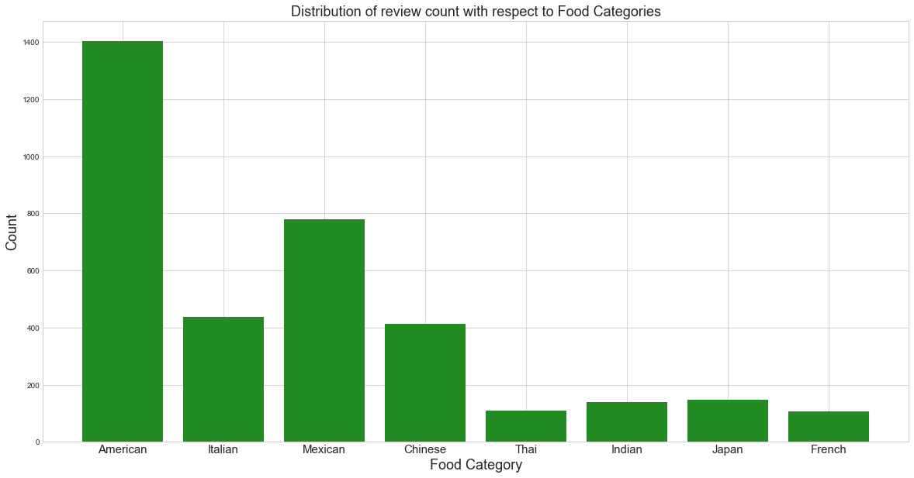


## Distribution(count) of American, Mexican, Italian, Chinese Restaurant rating
<font color='green'>
### We can see American and Italian restaurants are rated higher than other restaurants


```python
American_restaurant_rating_df = restaurant_df[restaurant_df['categories'].str.contains('American')==True][['business_id','stars','categories','name','review_count']]
Mexican_restaurant_rating_df = restaurant_df[restaurant_df['categories'].str.contains('Mexican')==True][['business_id','stars','categories','name','review_count']]
Chinese_restaurant_rating_df = restaurant_df[restaurant_df['categories'].str.contains('Chinese')==True][['business_id','stars','categories','name','review_count']]
Italian_restaurant_rating_df = restaurant_df[restaurant_df['categories'].str.contains('Italian')==True][['business_id','stars','categories','name','review_count']]

fig, ax = plt.subplots(nrows=2, ncols=2, figsize=(15, 8))
ax = ax.ravel()

def restaurant_category(df, title, ax):

    sns.distplot(df.stars,kde=False,color = 'g',ax =ax,bins=20);
    ax.axvline(df.stars.mean(), 0, 1, color='r', label='Mean')
    ax.legend();
    ax.set_ylabel('Count',size=20)
    ax.set_xlabel('Stars',size=20)
    ax.set_title('Distribution(count) of '+ title + ' Restaurant rating',size=20);

restaurant_category(American_restaurant_rating_df, 'American', ax[0])
restaurant_category(Mexican_restaurant_rating_df, 'Mexican', ax[1])
restaurant_category(Chinese_restaurant_rating_df, 'Chinese', ax[2])
restaurant_category(Italian_restaurant_rating_df, 'Italian', ax[3])

plt.tight_layout()
```


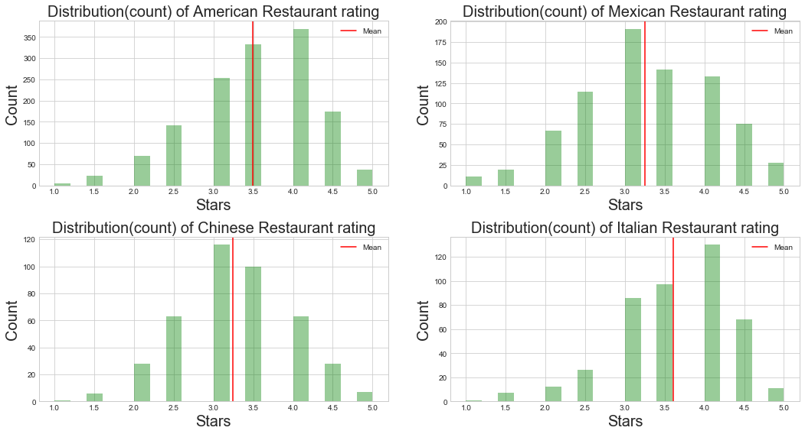


```python
American_restaurant_rating_df.head(2)
```


    ---------------------------------------------------------------------------

    NameError                                 Traceback (most recent call last)

    <ipython-input-2-063b38b70f8b> in <module>()
    ----> 1 American_restaurant_rating_df.head(2)


    NameError: name 'American_restaurant_rating_df' is not defined


## Top 20 American 5 star rated Restaurant


```python
American_top_rated_restaurant = American_restaurant_rating_df.sort_values(by=['stars','review_count'],
                                                 ascending=False)[['name','business_id','review_count','stars']]
#get top 20 5 star rated restaurant
n_top =20
American_top_rated_restaurant = American_top_rated_restaurant.nlargest(n_top, 'stars')
fig, ax = plt.subplots()
ax = sns.barplot(y="name", x="review_count", data=American_top_rated_restaurant)
ax.set_xlabel('Count',size=20)
fig.set_size_inches(12, 8)
plt.title("Top 20 American 5 star rated Restaurant",fontsize=24);
ax.grid(axis = 'x', color ='green', linestyle='-')
ax.tick_params(axis='both', which='both',length=0)
sns.despine(left=True, bottom=True)
```


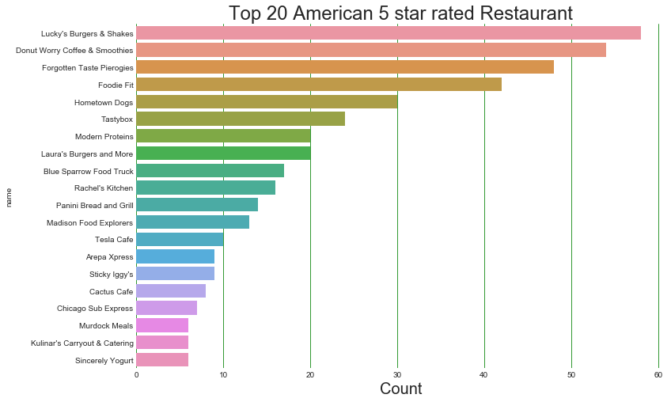


## High-count Top 10 users who reviewed Restaurant


```python

#get top 10 most reviewing users
n_top =10
most_review_user = user_df_filter_df.nlargest(n_top, 'review_count_y').reindex()
fig, ax = plt.subplots()
ax = sns.barplot(y="user_id", x="review_count_y", data=most_review_user)
ax.set_xlabel('Review Count',size=20)
fig.set_size_inches(12, 8)
plt.title("High count Top 10 users who reviewed Restaurant ",fontsize=24);
ax.grid(axis = 'x', color ='green', linestyle='-')
ax.tick_params(axis='both', which='both',length=0)
sns.despine(left=True, bottom=True)

```


## Distribution of Review Count given by users and given to Restaurant
<font color='green'>
### We can see that most review count is with less number of users and restaurants


```python
fig, ax = plt.subplots(nrows=1, ncols=2, figsize=(15, 8))
user_df_filter_df.review_count_y.hist(bins=400,ax=ax[0],color = 'g')
#plt.xlim([0,1000])
ax[0].legend();
ax[0].set_xlim([0,1000])
ax[0].set_ylabel('Review Count',size=20)
ax[0].set_xlabel('Num of Users',size=20)
ax[0].set_title('Distribution of Review Count given by User',size=20);

restaurant_df.review_count.hist(bins=400,ax=ax[1],color = 'g')
ax[1].set_xlim([0,300])
ax[1].legend();
ax[1].set_ylabel('Review Count',size=20)
ax[1].set_xlabel('Num of Restaurant',size=20)
ax[1].set_title('Distribution of Review Count given to Restaurant',size=20);

```


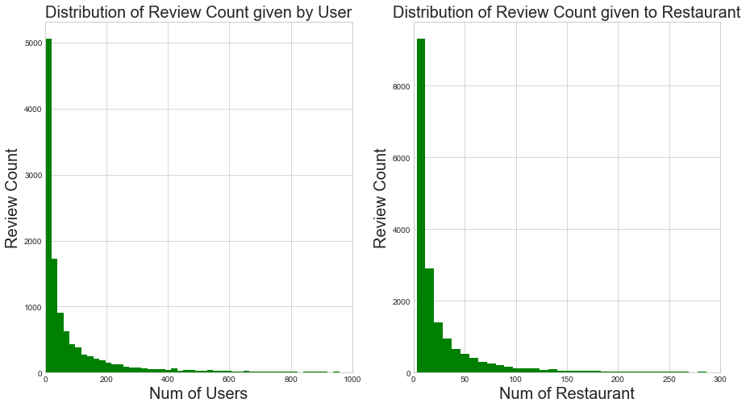


##  Creating Baseline Model


```python
complete_df.head(2)
```


<div>
<style>
    .dataframe thead tr:only-child th {
        text-align: right;
    }
    
    .dataframe thead th {
        text-align: left;
    }
    
    .dataframe tbody tr th {
        vertical-align: top;
    }
</style>
<table border="1" class="dataframe">
  <thead>
    <tr style="text-align: right;">
      <th></th>
      <th>address</th>
      <th>attributes</th>
      <th>business_id</th>
      <th>categories</th>
      <th>city</th>
      <th>hours</th>
      <th>is_open</th>
      <th>latitude</th>
      <th>longitude</th>
      <th>name_x</th>
      <th>neighborhood</th>
      <th>postal_code</th>
      <th>review_count_x</th>
      <th>stars_x</th>
      <th>state</th>
      <th>cool_x</th>
      <th>date</th>
      <th>funny_x</th>
      <th>review_id</th>
      <th>stars_y</th>
      <th>text</th>
      <th>useful_x</th>
      <th>user_id</th>
      <th>average_stars</th>
      <th>compliment_cool</th>
      <th>compliment_cute</th>
      <th>compliment_funny</th>
      <th>compliment_hot</th>
      <th>compliment_list</th>
      <th>compliment_more</th>
      <th>compliment_note</th>
      <th>compliment_photos</th>
      <th>compliment_plain</th>
      <th>compliment_profile</th>
      <th>compliment_writer</th>
      <th>cool_y</th>
      <th>elite</th>
      <th>fans</th>
      <th>friends</th>
      <th>funny_y</th>
      <th>name_y</th>
      <th>review_count_y</th>
      <th>useful_y</th>
      <th>yelping_since</th>
    </tr>
  </thead>
  <tbody>
    <tr>
      <th>0</th>
      <td>1203 E Charleston Blvd, Ste 140</td>
      <td>{'RestaurantsTableService': True, 'GoodForMeal...</td>
      <td>YTqtM2WFhcMZGeAGA08Cfg</td>
      <td>['Seafood', 'Restaurants', 'Specialty Food', '...</td>
      <td>Las Vegas</td>
      <td>{'Monday': '10:30-21:00', 'Tuesday': '10:30-21...</td>
      <td>1</td>
      <td>36.159363</td>
      <td>-115.135949</td>
      <td>Mariscos Playa Escondida</td>
      <td>Downtown</td>
      <td>89104</td>
      <td>330</td>
      <td>4.5</td>
      <td>NV</td>
      <td>0</td>
      <td>2016-09-16</td>
      <td>1</td>
      <td>ZH8g_PoY0Tr3YdQ-RGySrA</td>
      <td>5</td>
      <td>Great place. There was a man here who was very...</td>
      <td>1</td>
      <td>EDe16577dBImA1ypOzPlKg</td>
      <td>5.00</td>
      <td>0</td>
      <td>0</td>
      <td>0</td>
      <td>0</td>
      <td>0</td>
      <td>0</td>
      <td>0</td>
      <td>0</td>
      <td>0</td>
      <td>0</td>
      <td>0</td>
      <td>0</td>
      <td>[]</td>
      <td>0</td>
      <td>[]</td>
      <td>0</td>
      <td>Jessica</td>
      <td>1</td>
      <td>0</td>
      <td>2014-07-26</td>
    </tr>
    <tr>
      <th>1</th>
      <td>1203 E Charleston Blvd, Ste 140</td>
      <td>{'RestaurantsTableService': True, 'GoodForMeal...</td>
      <td>YTqtM2WFhcMZGeAGA08Cfg</td>
      <td>['Seafood', 'Restaurants', 'Specialty Food', '...</td>
      <td>Las Vegas</td>
      <td>{'Monday': '10:30-21:00', 'Tuesday': '10:30-21...</td>
      <td>1</td>
      <td>36.159363</td>
      <td>-115.135949</td>
      <td>Mariscos Playa Escondida</td>
      <td>Downtown</td>
      <td>89104</td>
      <td>330</td>
      <td>4.5</td>
      <td>NV</td>
      <td>1</td>
      <td>2014-11-13</td>
      <td>1</td>
      <td>6r2uAJE1dqUq1IHn_3R3qA</td>
      <td>4</td>
      <td>HOT HOT HOT! Real Mexican Food\n\nNO fake wate...</td>
      <td>2</td>
      <td>twx2ZgFUbat87vGQ_tFbPA</td>
      <td>3.55</td>
      <td>0</td>
      <td>0</td>
      <td>0</td>
      <td>2</td>
      <td>0</td>
      <td>1</td>
      <td>3</td>
      <td>0</td>
      <td>5</td>
      <td>0</td>
      <td>0</td>
      <td>11</td>
      <td>[]</td>
      <td>3</td>
      <td>[eFObFWgDiQJwUiy9WlhOfg, W4KL3Q_AVGfRrWcwR60gK...</td>
      <td>29</td>
      <td>Edwin</td>
      <td>94</td>
      <td>317</td>
      <td>2010-12-30</td>
    </tr>
  </tbody>
</table>
</div>


<font color='green'>
#### Taking only user_id, business_id, stars_y and using the surprise library(https://pypi.python.org/pypi/scikit-surprise)
Algorithm predicting the baseline estimate for given user and item.


```python
display(Math('r^ui=bui=μ+bu+bi'))
```


$$r^ui=bui=μ+bu+bi$$


```python
baseline_df = complete_df[['user_id','business_id','stars_y']]
```


```python
from surprise import SVD,BaselineOnly, Reader,KNNBaseline
from surprise import Dataset
from surprise import Reader
from surprise import evaluate, print_perf

reader = Reader(rating_scale=(1, 5))
data = Dataset.load_from_df(baseline_df,reader)
data.split(n_folds=3)
```


### BaselineOnly Model


```python
algo = BaselineOnly()
perf = evaluate(algo, data, measures=['RMSE', 'MAE'])
print_perf(perf)
```


    Evaluating RMSE, MAE of algorithm BaselineOnly.

    ------------
    Fold 1
    Estimating biases using als...
    RMSE: 1.2502
    MAE:  1.0162
    ------------
    Fold 2
    Estimating biases using als...
    RMSE: 1.2405
    MAE:  1.0106
    ------------
    Fold 3
    Estimating biases using als...
    RMSE: 1.2543
    MAE:  1.0210
    ------------
    ------------
    Mean RMSE: 1.2483
    Mean MAE : 1.0159
    ------------
    ------------
            Fold 1  Fold 2  Fold 3  Mean    
    RMSE    1.2502  1.2405  1.2543  1.2483  
    MAE     1.0162  1.0106  1.0210  1.0159  


### KNNBaseline Model

<font color = 'green'>
#### KNN Based on user restaurant rating


```python
display(Math(r'\hat{r}_{ui} = \mu_u + \sigma_u \frac{ \sum\limits_{v \in N^k_i(u)}\text{sim}(u, v) \cdot (r_{vi} - \mu_v) / \sigma_v} {\sum\limits_{v\in N^k_i(u)} \text{sim}(u, v)}'))

```


$$\hat{r}_{ui} = \mu_u + \sigma_u \frac{ \sum\limits_{v \in N^k_i(u)}\text{sim}(u, v) \cdot (r_{vi} - \mu_v) / \sigma_v} {\sum\limits_{v\in N^k_i(u)} \text{sim}(u, v)}$$


```python
algo = KNNBaseline()

perf = evaluate(algo, data, measures=['RMSE', 'MAE'])
print_perf(perf)
```


    Evaluating RMSE, MAE of algorithm KNNBaseline.

    ------------
    Fold 1
    Estimating biases using als...
    Computing the msd similarity matrix...
    Done computing similarity matrix.
    RMSE: 1.2662
    MAE:  1.0325
    ------------
    Fold 2
    Estimating biases using als...
    Computing the msd similarity matrix...
    Done computing similarity matrix.
    RMSE: 1.2587
    MAE:  1.0229
    ------------
    Fold 3
    Estimating biases using als...
    Computing the msd similarity matrix...
    Done computing similarity matrix.
    RMSE: 1.2439
    MAE:  1.0084
    ------------
    ------------
    Mean RMSE: 1.2563
    Mean MAE : 1.0213
    ------------
    ------------
            Fold 1  Fold 2  Fold 3  Mean    
    RMSE    1.2662  1.2587  1.2439  1.2563  
    MAE     1.0325  1.0229  1.0084  1.0213  


## Memory Based Collaborative filtering


```python
n_users = complete_df['user_id'].nunique()
n_restaurants = complete_df['business_id'].nunique()

print('Number of Unique Users: ', n_users)
print('Number of Restaurant: ',n_restaurants)
```


    Number of Unique Users:  11749
    Number of Restaurant:  482


### Train Test Split
<font color='green'>
#### Making user_id and business_id as nominal variable 


```python
unique_user_id = pd.DataFrame(complete_df['user_id'].unique(),columns =['user_id']).reset_index()
unique_user_id['new_user_id'] =unique_user_id['index']
del unique_user_id['index']

unique_business_id = pd.DataFrame(complete_df['business_id'].unique(),columns =['business_id']).reset_index()
unique_business_id['new_business_id'] =unique_business_id['index']
del unique_business_id['index']
```


```python
new_complete_df = complete_df.merge(unique_user_id,on='user_id',how ='left')
new_complete_df = new_complete_df.merge(unique_business_id,on='business_id',how ='left')
```


```python
new_complete_df.head(2)

```


<div>
<style>
    .dataframe thead tr:only-child th {
        text-align: right;
    }
    
    .dataframe thead th {
        text-align: left;
    }
    
    .dataframe tbody tr th {
        vertical-align: top;
    }
</style>
<table border="1" class="dataframe">
  <thead>
    <tr style="text-align: right;">
      <th></th>
      <th>address</th>
      <th>attributes</th>
      <th>business_id</th>
      <th>categories</th>
      <th>city</th>
      <th>hours</th>
      <th>is_open</th>
      <th>latitude</th>
      <th>longitude</th>
      <th>name_x</th>
      <th>neighborhood</th>
      <th>postal_code</th>
      <th>review_count_x</th>
      <th>stars_x</th>
      <th>state</th>
      <th>cool_x</th>
      <th>date</th>
      <th>funny_x</th>
      <th>review_id</th>
      <th>stars_y</th>
      <th>text</th>
      <th>useful_x</th>
      <th>user_id</th>
      <th>average_stars</th>
      <th>compliment_cool</th>
      <th>compliment_cute</th>
      <th>compliment_funny</th>
      <th>compliment_hot</th>
      <th>compliment_list</th>
      <th>compliment_more</th>
      <th>compliment_note</th>
      <th>compliment_photos</th>
      <th>compliment_plain</th>
      <th>compliment_profile</th>
      <th>compliment_writer</th>
      <th>cool_y</th>
      <th>elite</th>
      <th>fans</th>
      <th>friends</th>
      <th>funny_y</th>
      <th>name_y</th>
      <th>review_count_y</th>
      <th>useful_y</th>
      <th>yelping_since</th>
      <th>new_user_id</th>
      <th>new_business_id</th>
    </tr>
  </thead>
  <tbody>
    <tr>
      <th>0</th>
      <td>1203 E Charleston Blvd, Ste 140</td>
      <td>{'RestaurantsTableService': True, 'GoodForMeal...</td>
      <td>YTqtM2WFhcMZGeAGA08Cfg</td>
      <td>['Seafood', 'Restaurants', 'Specialty Food', '...</td>
      <td>Las Vegas</td>
      <td>{'Monday': '10:30-21:00', 'Tuesday': '10:30-21...</td>
      <td>1</td>
      <td>36.159363</td>
      <td>-115.135949</td>
      <td>Mariscos Playa Escondida</td>
      <td>Downtown</td>
      <td>89104</td>
      <td>330</td>
      <td>4.5</td>
      <td>NV</td>
      <td>0</td>
      <td>2016-09-16</td>
      <td>1</td>
      <td>ZH8g_PoY0Tr3YdQ-RGySrA</td>
      <td>5</td>
      <td>Great place. There was a man here who was very...</td>
      <td>1</td>
      <td>EDe16577dBImA1ypOzPlKg</td>
      <td>5.00</td>
      <td>0</td>
      <td>0</td>
      <td>0</td>
      <td>0</td>
      <td>0</td>
      <td>0</td>
      <td>0</td>
      <td>0</td>
      <td>0</td>
      <td>0</td>
      <td>0</td>
      <td>0</td>
      <td>[]</td>
      <td>0</td>
      <td>[]</td>
      <td>0</td>
      <td>Jessica</td>
      <td>1</td>
      <td>0</td>
      <td>2014-07-26</td>
      <td>0</td>
      <td>0</td>
    </tr>
    <tr>
      <th>1</th>
      <td>1203 E Charleston Blvd, Ste 140</td>
      <td>{'RestaurantsTableService': True, 'GoodForMeal...</td>
      <td>YTqtM2WFhcMZGeAGA08Cfg</td>
      <td>['Seafood', 'Restaurants', 'Specialty Food', '...</td>
      <td>Las Vegas</td>
      <td>{'Monday': '10:30-21:00', 'Tuesday': '10:30-21...</td>
      <td>1</td>
      <td>36.159363</td>
      <td>-115.135949</td>
      <td>Mariscos Playa Escondida</td>
      <td>Downtown</td>
      <td>89104</td>
      <td>330</td>
      <td>4.5</td>
      <td>NV</td>
      <td>1</td>
      <td>2014-11-13</td>
      <td>1</td>
      <td>6r2uAJE1dqUq1IHn_3R3qA</td>
      <td>4</td>
      <td>HOT HOT HOT! Real Mexican Food\n\nNO fake wate...</td>
      <td>2</td>
      <td>twx2ZgFUbat87vGQ_tFbPA</td>
      <td>3.55</td>
      <td>0</td>
      <td>0</td>
      <td>0</td>
      <td>2</td>
      <td>0</td>
      <td>1</td>
      <td>3</td>
      <td>0</td>
      <td>5</td>
      <td>0</td>
      <td>0</td>
      <td>11</td>
      <td>[]</td>
      <td>3</td>
      <td>[eFObFWgDiQJwUiy9WlhOfg, W4KL3Q_AVGfRrWcwR60gK...</td>
      <td>29</td>
      <td>Edwin</td>
      <td>94</td>
      <td>317</td>
      <td>2010-12-30</td>
      <td>1</td>
      <td>0</td>
    </tr>
  </tbody>
</table>
</div>


### Train Test Split
<font color='green'>
#### Making user_id and business_id as nominal variable 


```python
from sklearn.cross_validation import train_test_split
train_data, test_data = train_test_split(new_complete_df, test_size=0.25)
```


```python
test_data.shape
```


    (3218, 46)


```python
#Create two user and restaurant matrices, one for training and another for testing
train_data_matrix = np.zeros((n_users, n_restaurants))
for row in train_data.itertuples():
    # selecting new_user_id, new_restaurant_id, and rating star
    train_data_matrix[row[45]-1, row[46]-1] = row[20]  

test_data_matrix = np.zeros((n_users, n_restaurants))
for line in test_data.itertuples():
    test_data_matrix[row[45]-1, row[46]-1] = row[20]  
```


```python
train_data_matrix.shape
```


    (11749, 482)


```python
test_data_matrix.shape
```


    (11749, 482)


```python
from sklearn.metrics.pairwise import pairwise_distances
user_similarity = pairwise_distances(train_data_matrix, metric='cosine')
restaurant_similarity = pairwise_distances(train_data_matrix.T, metric='cosine')
```


```python
def predict(ratings, similarity, type='user'):
    if type == 'user':
        mean_user_rating = ratings.mean(axis=1)
        #You use np.newaxis so that mean_user_rating has same format as ratings
        ratings_diff = (ratings - mean_user_rating[:, np.newaxis]) 
        pred = mean_user_rating[:, np.newaxis] + similarity.dot(ratings_diff) / np.array([np.abs(similarity).sum(axis=1)]).T
    elif type == 'item':
        pred = ratings.dot(similarity) / np.array([np.abs(similarity).sum(axis=1)])     
    return pred
```


```python
restaurant_prediction = predict(train_data_matrix, restaurant_similarity, type='item')
user_prediction = predict(train_data_matrix, user_similarity, type='user')

restaurant_prediction_test = predict(test_data_matrix, restaurant_similarity, type='item')
user_prediction_test = predict(test_data_matrix, user_similarity, type='user')

```


```python
model_memory_based_pred_res = restaurant_prediction
model_memory_based_pred_user = user_prediction

```


```python
model_memory_based_pred_res_test = restaurant_prediction_test
model_memory_based_pred_user_test = user_prediction_test
```


```python
model_memory_based_pred_user.shape
```


    (11749, 482)


### Evaluation


```python
from sklearn.metrics import mean_squared_log_error
from math import sqrt
def rmse(prediction, ground_truth):
    prediction = prediction[ground_truth.nonzero()].flatten() 
    ground_truth = ground_truth[ground_truth.nonzero()].flatten()
    return sqrt(mean_squared_log_error(prediction, ground_truth))
```


```python
print('User-based CF RMSE: ' + str(rmse(user_prediction, test_data_matrix)))
print('Item-based CF RMSE: ' + str(rmse(restaurant_prediction, test_data_matrix)))
```


    User-based CF RMSE: 1.7855838795222876
    Item-based CF RMSE: 1.791759469228055


```python
print('User-based CF RMSE: ' + str(rmse(user_prediction_test, test_data_matrix)))
print('Item-based CF RMSE: ' + str(rmse(restaurant_prediction_test, test_data_matrix)))
```


    User-based CF RMSE: 1.7814394601960655
    Item-based CF RMSE: 1.791759469228055


### SVD


```python
import scipy.sparse as sp
from scipy.sparse.linalg import svds

#get SVD components from train matrix. Choose k.
u, s, vt = svds(train_data_matrix, k =10)
s_diag_matrix=np.diag(s)
X_pred = np.dot(np.dot(u, s_diag_matrix), vt)
```


```python
u,s,vt
```


    (array([[  3.34049657e-17,   1.24991845e-06,  -5.62863149e-06, ...,
              -2.40778734e-04,   1.66342739e-03,   5.35846521e-02],
            [  0.00000000e+00,   0.00000000e+00,   0.00000000e+00, ...,
               0.00000000e+00,   0.00000000e+00,   0.00000000e+00],
            [  4.17562072e-17,   1.56239806e-06,  -7.03578937e-06, ...,
              -3.00973418e-04,   2.07928424e-03,   6.69808152e-02],
            ..., 
            [ -2.52694152e-17,   9.27804311e-08,  -2.07726738e-03, ...,
               5.99920397e-07,  -2.71221463e-09,   3.24121438e-09],
            [ -2.52694152e-17,   9.27804311e-08,  -2.07726738e-03, ...,
               5.99920397e-07,  -2.71221463e-09,   3.24121438e-09],
            [  0.00000000e+00,   0.00000000e+00,   0.00000000e+00, ...,
               0.00000000e+00,   0.00000000e+00,   0.00000000e+00]]),
     array([ 53.17643053,  53.67574176,  54.45775196,  55.39408552,
             55.44130123,  56.40848564,  69.47353176,  74.29736843,
             74.53257863,  74.57839766]),
     array([[  2.78084305e-16,   5.20417043e-17,   8.63892291e-16, ...,
               5.23967728e-17,  -2.45919167e-18,   4.44089210e-16],
            [ -6.51182607e-03,  -2.22125771e-04,   6.67698688e-05, ...,
               1.83575939e-17,   8.76235443e-18,   1.67725749e-05],
            [ -9.96913395e-07,  -4.06463072e-06,  -9.38434558e-05, ...,
              -1.84763414e-17,   7.98872131e-18,  -7.66306544e-05],
            ..., 
            [  4.02264688e-05,   1.30972069e-02,   9.97892298e-04, ...,
              -1.89867683e-17,  -5.98092194e-18,  -4.47230658e-03],
            [ -5.76288178e-05,  -5.07967905e-05,   4.83647324e-04, ...,
              -5.78431017e-17,   2.17080572e-18,   3.09948833e-02],
            [  6.65940501e-05,   4.59236238e-04,   2.75722771e-02, ...,
              -6.54104231e-17,   1.32723866e-17,   9.99064374e-01]]))


```python
print('User-based CF MSE: ' + str(rmse(X_pred, test_data_matrix)))
```


```python
print('User-based CF MSE: ' + str(rmse(X_pred, train_data_matrix)))
```


    User-based CF MSE: 1.3158295177785562


```python
u_test, s_test, vt_test = svds(test_data_matrix, k =10)
#s_diag_test_matrix=np.diag(s_test)
#X_test_pred = np.dot(np.dot(u_test, s_diag_test_matrix), vt_test)
```


```python
X_pred_test = np.dot(np.dot(u_test, s_diag_matrix), vt)
```


```python
print('User-based CF MSE: ' + str(rmse(X_pred_test, test_data_matrix)))
```


    User-based CF MSE: 1.7917594692280685


```python
model_svd_based_pred = X_pred
model_svd_based_pred_test = X_pred_test
```


### Meta Classifier


```python
model_memory_based_pred_res_flat = model_memory_based_pred_res.ravel()
model_memory_based_pred_user_flat = model_memory_based_pred_user.ravel()
model_svd_based_pred_flat = model_svd_based_pred.ravel()
```


```python
model_memory_based_pred_res_test_flat = model_memory_based_pred_res_test.ravel()
model_memory_based_pred_user_test_flat = model_memory_based_pred_user_test.ravel()
model_svd_based_pred_test_flat = model_svd_based_pred_test.ravel()
```


```python
model_memory_based_pred_res_flat.size
```


    5663018


```python
pred_model_array_train =  np.zeros((model_memory_based_pred_res_flat.size,3))
pred_model_array_test =  np.zeros((model_memory_based_pred_res_test_flat.size,3))
```


```python
model_memory_based_pred_res_flat.size
```


    5663018


```python
pred_model_array.shape
```


    (5663018, 3)


```python
pred_model_array_train[:,0] = model_memory_based_pred_res_flat
pred_model_array_train[:,1] = model_memory_based_pred_user_flat 
pred_model_array_train[:,2] = model_svd_based_pred_flat
```


```python
pred_model_array_test[:,0] = model_memory_based_pred_res_test_flat
pred_model_array_test[:,1] = model_memory_based_pred_user_test_flat 
pred_model_array_test[:,2] = model_svd_based_pred_test_flat

```


```python
y_train_data_matrix_flat = train_data_matrix.ravel()
y_test_data_matrix_flat = test_data_matrix.ravel()
y_test_data_matrix_flat.size
```


    5663018


```python
def rmse_new(prediction, ground_truth):
    #prediction = prediction.nonzero()
    #ground_truth = ground_truth.nonzero()
    return sqrt(mean_squared_log_error(prediction, ground_truth))
```


```python
from sklearn.metrics import mean_squared_error
logreg = LogisticRegressionCV()
y_hat_train = logreg.fit(pred_model_array_train[0:100000], y_train_data_matrix_flat[0:100000]).predict(pred_model_array_train[0:100000])
y_hat_test = logreg.fit(pred_model_array_train[0:100000], y_train_data_matrix_flat[0:100000]).predict(pred_model_array_test)

print("Test LogReg: ", rmse_new(y_test_data_matrix_flat, y_hat_test))
print("Train LogReg: ", rmse_new(y_train_data_matrix_flat[0:100000], y_hat_train))
```


    Test LogReg:  0.0257101738036102
    Train LogReg:  0.011819661367076774


```python
y_test_data_matrix_flat.shape,y_hat_test.shape
```


    ((5663018,), (5663018,))


```python

```

